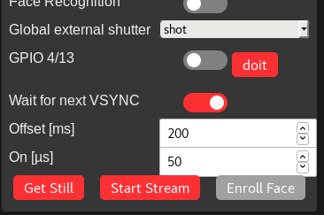
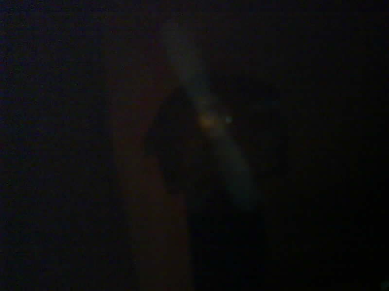
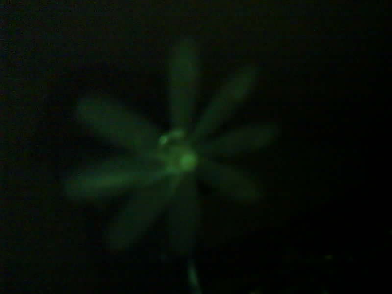

## ESP32-CAM ov2640 sensor global (external) shutter

Associated [esp32.com forum thread](https://www.esp32.com/viewtopic.php?f=19&t=11126).

This is a sub project of [Raspberry v1 camera global external shutter](../../..).

* [Introduction](#introduction)
* [Setup for global (external) shutter](#setup-for-global-external-shutter)
* [Tools](#tools)
* [Requirements](#requirements)
* [Capturing](#capturing)
* [Single exposure](#single-exposure)
* [Multiple exposure](#multiple-exposure)
  * [shots tool](#shots-tool)
* [Differences to Raspberry v1 camera](#differences-to-raspberry-v1-camera)
  * [Capturing global shutter frames at daylight](#capturing-global-shutter-frames-at-daylight)
  * [Mixed rolling and global shutter frames](#mixed-rolling-and-global-shutter-frames)

## Introduction

ESP32-CAM ov2640 image sensor is a predecessor of v1 camera ov5647 sensor. From the 38 pins inside ov2640 image sensor unfortunately pin B2 (FREX) is not exposed via flat ribbon connector cable. Surprisingly even without access to that sensor pin global external shutter frames can be captured. It is still not 100% clear how, but it works. See section [Differences to Raspberry v1 camera](#differences-to-raspberry-v1-camera) on interesting features of global external shutter capturing that only ov2640 sensor has.

In order to use FCameraWebServer as 2nd Arduino IDE ESP32->Camera example only one symbolic link needs to be created:

    cd ~/.arduino15/packages/esp32/hardware/esp32/1.0.2/libraries/ESP32/examples/Camera
    ln -s ~/Raspberry_v1_camera_global_external_shutter/FCameraWebServer

This allows to use github sub project FCameraWebServer in Arduino IDE as if it was installed with arduino-esp32 examples.

## Setup for global (external) shutter

See section [Capturing global shutter frames at daylight](#capturing-global-shutter-frames-at-daylight) on why an external shutter is not necessarily needed(!) for ov2640 sensor.

tbd

## Tools

* [FCameraWebServer.ino](FCameraWebServer.ino) (ESP32-CAM Arduino sketch providing new "Flash" and "Global external shutter" features)

* [index/get_index_html](index/get_index_html) (extracts camera_index.h into index/index.html for modifications)
* [index/put_index_html](index/put_index_html) (creates new camera_index.h from modified index/index.html)

Howto compile FCameraWebServer for ESP32-CAM module:
* load "Examples->ESP32->CAMERA->FCameraWebServer" into Arduino IDE
* in [FCameraWebServer.ino](FCameraWebServer.ino)
  * comment out CAMERA_MODEL_WROVER_KIT #define
  * uncomment CAMERA_MODEL_AI_THINKER #define
  * populate ssid and password variables
* select "ESP32 Dev Module" under Tools->Board
* select "Huge App [3MB ..." under Tools->Partition Scheme
* compile

It is invaluable to have git history on extrated [index/index.html](index/index.html), therefore its versions got pushed to github (and will be pushed from now on) although being redundant. Normal workflow now is "do changes to index/index.html, then do put_index_html to get those changes into camera_index.h". Normally tool get_index_html does not need to be called anymore.

Executing get_index_html tool in index folder, and then put_index_html tool should be an identity transform on camera_index.h (because index.html was not changed). Unfortunately the gunzip followed by gzip does change few bytes in first line:

    ...
     const uint8_t index_ov2640_html_gz[] = {
    - 0x1F, 0x8B, 0x08, 0x08, 0x99, 0x83, 0x16, 0x5D, 0x00, 0x03, 0x69, 0x6E, 0x64, 
    + 0x1F, 0x8B, 0x08, 0x08, 0x91, 0x84, 0x16, 0x5D, 0x00, 0x03, 0x69, 0x6E, 0x64, 
      0x68, 0x74, 0x6D, 0x6C, 0x00, 0xE5, 0x5D, 0xEB, 0x92, 0xD3, 0xC6, 0x12, 0xFE, 
    ...

If this is the only change in camera_index.h and not wanted, "git checkout -- camera_index.h" does "undo" that.

## Requirements

No requirements for "Flash" toggle. This new feature is unrelated to global external shutter work:  

It allows to capture with ESP32-CAM flash off or on:  

Be careful and turn it not on for too long, otherwise the builtin flash might suffer.

## Capturing

tbd

## Single exposure

This was menu settings for first time capture of "shot" option:  

Because the internal flash on GPIO4 was used to light the dark scene, and 50µs is not that long, the frame looks a little dark. Mini drone propeller was rotating fast when capturing this frame:  

## Multiple exposure

#### shots tool

This was menu settings for first time capture of "shots" option after being implemented:  

Because the internal flash on GPIO4 was used to light the dark scene, and 50µs is not that long, the frame looks a little dark:  

## Differences to Raspberry v1 camera

#### Capturing global shutter frames at daylight

Unlike Raspberry v1 camera that needs dark scene for taking global external shutter frames, ov2640 can capture global shutter frames at daylight as well (no external shutter cardboard box needed). Not fully understood yet:  

#### Mixed rolling and global shutter frames

I have no explanation and thought this would not be possible. But ov2640 can capture frames with region showing rolling shutter effect and region showing global shutter effect! The horizontal lines are rolling shutter effect from fast rotating mini drone propeller, but below that you can see region with global shutter effect capturing parts of the fast rotating propeller as if it stood still. Not fully understood yet:  

tbd
