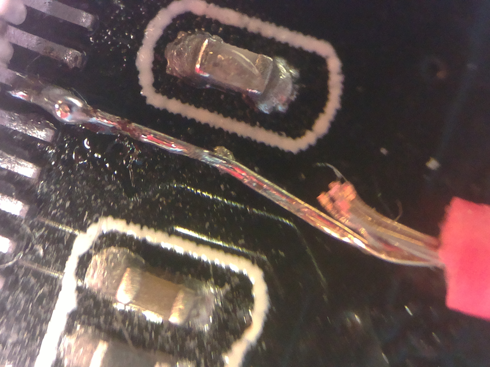

## ESP32-CAM ov2640 sensor global external shutter

* [Introduction](#introduction)
* [Setup for global external shutter](#setup-for-global-external-shutter)
* [Tools](#tools)
* [Requirements](#requirements)
* [Capturing](#capturing)
* [Single exposure](#single-exposure)
* [Multiple exposure](#multiple-exposure)
  * [shots tool](#shots-tool)

## Introduction

This is a sub project of [Raspberry v1 camera global external shutter](../README.md). ESP32-CAM ov2640 image sensor is a predecessor of v1 camera ov5647 sensor. From the 38 pins inside ov2640 image sensor unfortunately pins B2 (FREX) and A2 are connected. Because of that global external shutter with ov2640 sensor has some limitations compared to v1 camera. See section [Requirements](#requirements) for needed soldering for ESP32-CAM module.

## Setup for global external shutter

tbd

## Tools

* [FCameraWebServer](FCameraWebServer) (ESP32 Arduino sketch providing new feature)

* [get_index_html](index/get_index_html) (extracts index.html into index directory for modifications)
* [put_index_html](index/put_index_html) (creates new camera_index.h from modified index directory index.html)

## Requirements

No rquirements for "Flash" toggle.

For the global external shutter features, a cable has to be soldered carefully to pin10 of the ov2640 flat ribbon cable connector on ESP32-CAM module (the pins are 0.5mm spaced, I used a [Raspberry v1 camera preview on HDMI monitor as magnifying glass](https://www.esp32.com/viewtopic.php?f=19&t=11126&p=45445#p45445) for soldering, and superglued the cable plastic to ESP32-CAM module for stress relief):

## Capturing

tbd

## Single exposure

tbd

## Multiple exposure

#### shots tool

tbd
