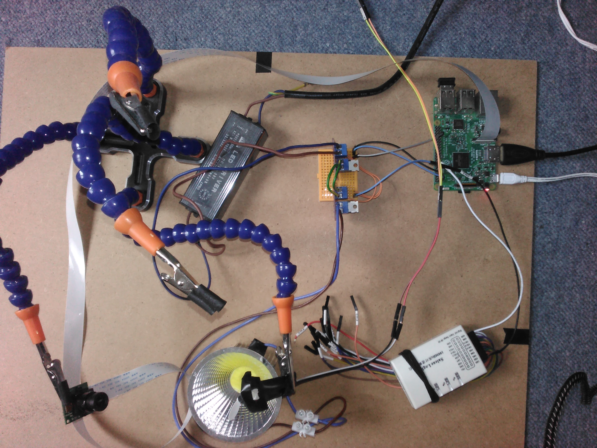
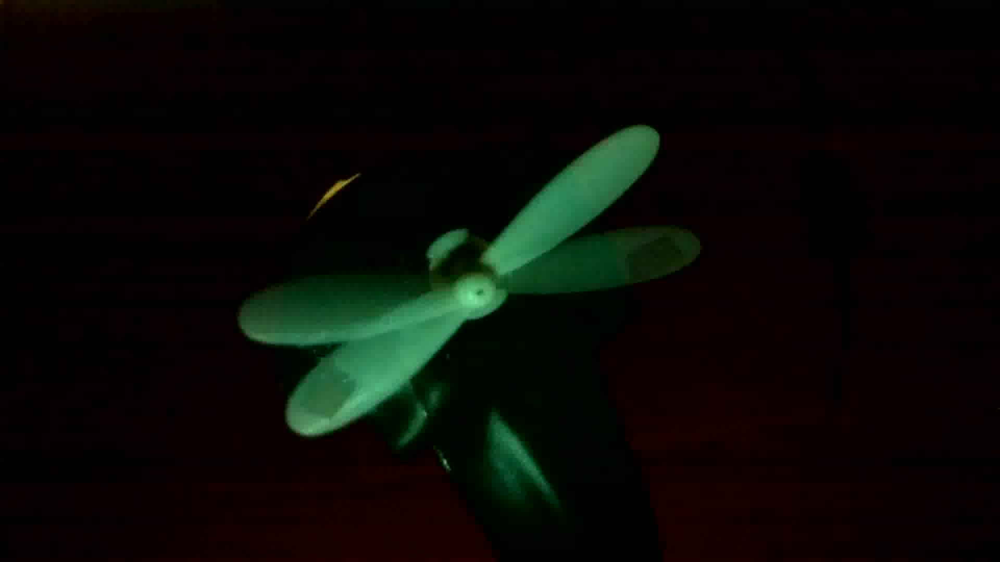
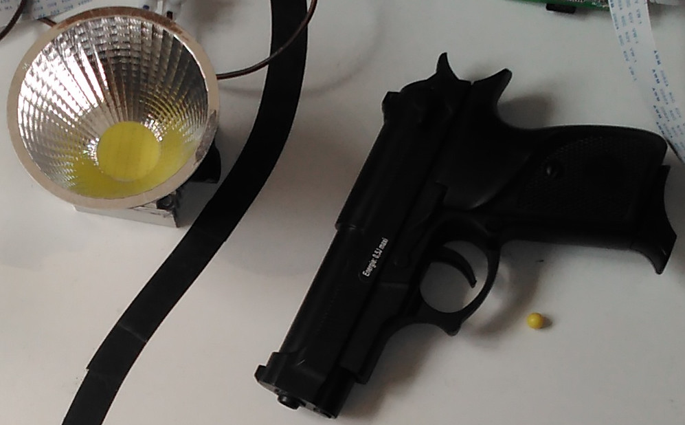

## Raspberry v1 camera global external shutter

Associated [Raspberry forum thread](https://www.raspberrypi.org/forums/viewtopic.php?f=43&t=241418).

* [Introduction](#introduction)
* [Setup for global external shutter](#setup-for-global-external-shutter)
* [Tools](#tools)
* [Requirements](#requirements)
* [Capturing](#capturing)
* [Single exposure](#single-exposure)
* [Multiple exposure](#multiple-exposure)
  * [shots tool](#shots-tool)
  * [PWM exposure](#pwm-exposure)
* [Hardware camera sync pulses](#hardware-camera-sync-pulses)

## Introduction

Raspberry v1 camera (or clone, v1 camera was sold last 2016 by Raspberry Pi Foundation) does not provide a global shutter mode. But it does provide a "global reset" feature/[FREX mode](https://cdn.sparkfun.com/datasheets/Dev/RaspberryPi/ov5647_full.pdf#page=43) (whole frame pixels start integration at the same time, rather than integrating row by row). 

This repo describes how to build an external shutter for v1 camera and provides tools allowing for taking Raspberry v1 camera global external shutter videos.

So why do you may want global shutter videos?

Mostly for fast moving scenes. The propeller of mini drone rotates with 26000rpm and has a blade diameter of 34mm. The radial speed at blade tips is quite high, 0.034m×pi×(26000/60)=46.3m/s(!) or 166.6km/h.

This is a frame you get with v1 camera normal [rolling shutter](https://en.wikipedia.org/wiki/Rolling_shutter) mode, total distortion:  

This is animation of video taken with global external shutter technique (scene lit by 5000lm led with 36µs strobe pulse duration; 1 second from 25fps video, converted into an animated .gif playing at 5fps, allowing to really see each single global shutter frame, as well as to see that the other propellers+motors are heavily shaken by the front propeller wind):   

How do you get that? By powering off light quickly after the end of the strobe pulse, and a really dark scene. Only that way further accumulation of light can be avoided for the lower lines of the frame that are sent to Pi from camera later than the very first lines.

These methods for total darkness work:
- close room door and window shutter completely
- cover complete setup (2nd "shots tool" section example) with moving box
- cover only camera, bright light and eg. propeller with moving box 

## Setup for global external shutter

This is the setup:

You need (aliexpress.com free shipping prices):
* very bright 50W 5000lm led (2$)
* 40x40x20mm aluminum heatsink (2$)
* 50W led driver (7$)
* plastic COB reflector (3$)
* IRF520 mosfets (2×1$)
* v1 camera (clone 6$)
* spare drone motor+propeller (4$)

The 0-24V IRF520 mosfets are used in series to control 38V/1.5A from 50W led driver to 5000lm led. Pi GPIO13 is connected with both mosfet SIG pins. Power the propeller from an independent power source, I use a constant voltage power supply because that allows to easily change propeller voltage and by that propeller rpm.

In above photo reflector sits on 5000lm led sits on top of aluminum heatsink. Here is another option for light direction vertically down, aluminum heatsink on top of 5000lm led on top of reflector on top of plexiglas above scene:

The smaller the distance from led to object, the more lumens from same 5000lm led. In case you can place the object you want to light directly above the led, it is better to not use the reflector at all. The Raspberry v1 camera captures from below led level slightly upwards. This increases brightness of captured frames over using the reflector:

See airshot pistol shot just above 5000lm led without reflector for another example: [PWM exposure](#pwm-exposure)

## Tools

* [raspivid_ges](tools/raspivid_ges) (if starting with default parameters, captures 2MP tst.h264 video at 1fps global external shutter mode)
* [raspividyuv_ges](tools/raspividyuv_ges) (global external shutter for raspividyuv)
*
* [shot](tools/shot) (single exposure)
*
* [shots](tools/shots) (multiple exposure)
* [5shots](tools/5shots) (sample for different strobe pulse length multiple exposure)  
* [pwm_ges](tools/pwm_ges) (pwm exposure)
*
* [gpio_alert.c](tools/gpio_alert.c) (camera synced multiple exposure sample)
*
* [toFrames](tools/toFrames) (converts .h264 video (tst.h264 by default) to multiple frames (frame0000.jpg, frame0001.jpg, ...))

## Requirements

pigpio library can be found here: [http://abyz.me.uk/rpi/pigpio/download.html](http://abyz.me.uk/rpi/pigpio/download.html).

Hardware PWM is available on GPIO(12|18) and GPIO(13|19) only (pigpio [software PWM frequencies](http://abyz.me.uk/rpi/pigpio/pigs.html#PFS) are too restricted). 

|               |HW PWM|any GPIO| |pigpio|ffmpeg| |I2C|camera|
|--------------:|:----:|:------:|-|:----:|:----:|-|:-:|:----:|
|   raspivid_ges|      |   ×    | |   ×  |      | | × |   ×  |
|raspividyuv_ges|      |   ×    | |   ×  |      | | × |   ×  |
|           shot|      |   ×    | |   ×  |      | |   |      |
|          shots|      |   ×    | |   ×  |      | |   |      |
|         5shots|      |   ×    | |   ×  |      | |   |      |
|        pwm_ges|  ×   |        | |   ×  |      | |   |      |
|     gpio_alert|      |   ×    | |   ×  |      | |   |      |
|       toFrames|      |        | |      |   ×  | |   |      |

## Capturing

Just calling "raspivid_ges" starts raspivid with default parameters (mode 1 capture at 1fps, 960x540 preview window, flash AWB, output to tst.h264, in background, endless runtime), triggers 2s continuous strobe just before starting raspivid for getting correct settings by AWB, injects I2C commands to bring v1 camera into global external shutter mode and waits for raspivid to end. With default parameter endless runtime you can simply end raspivid_ges by pressing CTRL-C. In case you provide different set of parameters and do some "-t ..." setting, raspivid_ges ends after raspivid completed.

If you want one terminal only (text mode/X11 or ssh session), you can start raspivid_ges in background as well, otherwise you can execute the tools shot/shots/5shots/pwm_ges from a second terminal. You can repeat executing those tools while raspivid_ges is running. In case HDMI monitor is connected, you can directly see the effects on calling such a tool (with a <1s delay) on HDMI monitor preview. One property of global external shutter technique is, that you can look at the rotating propeller directly without HDMI monitor, and see the same global shutter effects directly with just your eyes.

So a session for capturing a single "shot" tool frame example is this:

	$ ssh pi@yourpi
	...
	$ raspivid_ges &
	$ PID=$!
	$ shot
	$ kill -9 $PID
	$ toFrames 
	$ logout
	$ rm -f frame????.jpg; scp pi@yourpi:frame????.jpg .; eog frame????.jpg

You will step through the extracted 2MP frames from captured tst.h264 with eog tool to find the one frame with the captured flash.

## Single exposure

Single exposure global shutter capturing is when at most one strobe flash happens per frame. Tool [shot](tools/shot) allows you to send a single flash pulse (by default 9µs pulse duration to GPIO13, you can pass different arguments):

	$ shot 9 13
	$

## Multiple exposure

In this scenario more than one strobe flash happens per frame captured. Since by that exposures can be far more frequent than any high framerate video capturing can do (maximally 750fps/1007fps for v1/v2 camera, due to needed slow frame transfer to Pi), this will be called "x eps frame" (exposures per second).  

#### shots tool

Tool [shots](tools/shots) allows to send multiple strobe pulses (by default five 9µs pulses 241µs apart on GPIO13):

	$ shots
	$

This is a "4000 eps frame" (1000000/(9+241)):

Same scene with different lighting, in case you have no room where you can close all doors and all window shutters. Just put a moving box above the complete setup:

Different parameters example:

	$ shots 9 9 116
	$

This is a "8000 eps frame" (1000000/(9+116)):

Tool [5shots](tools/5shots) does 5 exposures with different strobe pulse widths (1/3/5/7/9µs pulse widths):

	$ 5shots
	$

Same scene with slightly different lighting (you can see 5 blades with reflective tape at bottom):

"shots 2 9 900000" captures two 9µs strobe pulse widths, 0.9s apart. With raspivid_ges tool's "-fps 1" default setting most times the first flash happens on one tst.h264 frame captured, and the 2nd flash happens on the next frame. But after 15 attempts I was successful and captured both flashes on same frame, proving that it is possible:

#### PWM exposure

Above captures were all radial, this one is linear. The frame captured 6mm diameter airsoft pistol bullet in flight. A fixed length pigpio waveform (as in shots) would need synchronization between triggering shot and triggering waveform (accoustic, laser light barrier or 665/1007fps high framerate video detection).  The simpler approach taken here is to use 3kHz PWM signal on GPIO13 with duty cycle 2.5% (8.33µs). Each 1fps frame gets 3000 flashes. This cannot be done inside moving box because all you would get is a white frame. Tool pwm_ges called without arguments uses exactly those settings as defaults. The command generates 6000 strobe pulses in order to not confuse raspivid AWB:

	$ pwm_ges
	$

This is a "3000 eps frame":

The frame is not perfect, just the first capture of flying bullet, not sharp because lens was not adjusted well, but it is proof that capturing (rifle) bullets in flight is possible with v1 camera!

The frame allowed to determine bullet speed while flying through camera view! The bullet diameter is 6mm, and I used gimp to measure diameter of bullet as 357 pixel. The distance from left side of 2nd to left side of 3rd bullet in frame was 563 pixels. Bullet speed therefore is (563px / 357px) × 6mm × 3000Hz = 28.38m/s.

Just for completeness, this is the 0.5 Joule 13$ airsoft pistol used, and a 6mm diameter 0.12g pellet:  

With lens sharp, background dark (doing raspivid_ges with framerate 30fps instead of 1fps results in only 100 strobe pulses lighting background for 3kHz PWM),

	$ raspivid_ges -md 1 -p 10,10,960,540 -fps 30 -awb flash -o tst.h264 -pts tst.pts -t 0

and without reflector (for shooting just above the 5000lm led at bottom, in order to increase lumens) muzzle speed is roughly

	(236px / 117px) * 6mm * 3000Hz = 36.3m/s

Todos:
Next step is to use air gun for higher muzzle speed, and finally a real rifle. A 375m/s bullet does move 0.375mm/µs. If a frame every 3cm is wanted, exposures have to be taken every 30/0.375=80µs. The result will be a 12500 eps(!) frame (1000000/80).

## Hardware camera sync pulses

Tool [shots](tools/shots) is not synced with camera frames. shots tool might split its strobe pulses onto more than one frame because of the missing synchronization with camera.

In thread "Hardware camera sync pulses"  
[https://www.raspberrypi.org/forums/viewtopic.php?f=43&t=190314](https://www.raspberrypi.org/forums/viewtopic.php?f=43&t=190314)  
it was stated that as of the 22nd July 2017 firmware, there is support for repurposing the camera LED GPIO to change state on frame start and frame end interrupts.

As described in one of my postings in that thread I was able to make the hardware camera sync pulses appear on GPIO18.

New tool [gpio_alert.c](tools/gpio_alert.c) is camera synced multiple exposure sample. You compile it with 

	$ gcc -O6 -o gpio_alert gpio_alert.c -lpigpio -lrt -lpthread
	$

The tool uses GPIO13 for triggering two 9µs strobe pulses, 925000µs apart, synced with camera. Therefore both strobe pulses will always appear on a single frame captured with "-fps 1". I tested with pulses 950000µs apart, and there strobe pulses are split onto two frames in a strange way:  
[1st strange frame](https://raw.githubusercontent.com/Hermann-SW/Raspberry_v1_camera_global_external_shutter/master/res/two.HWsync.0a.jpg)  
[2nd strange frame](https://raw.githubusercontent.com/Hermann-SW/Raspberry_v1_camera_global_external_shutter/master/res/two.HWsync.0b.jpg)  

raspivid_ges starts pigpiod. For running gpio_alert, the daemon needs to be killed first after having started raspivid_ges:

	$ sudo killall pigpiod
	$ sudo ./gpio_alert 10
	$

The argument that has to be passed is the number of frames with camera synced double exposure.

This is one sample frame capture that way:

This is another sample frame capture that way, which looks different because of small changes in propeller speed:

