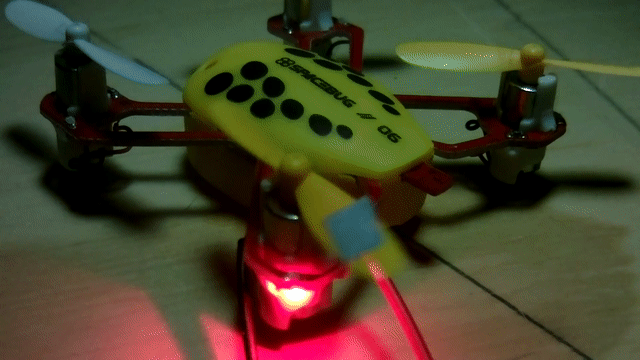
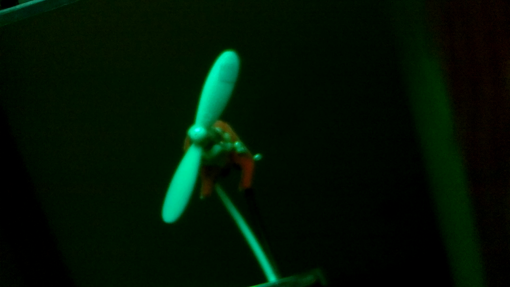
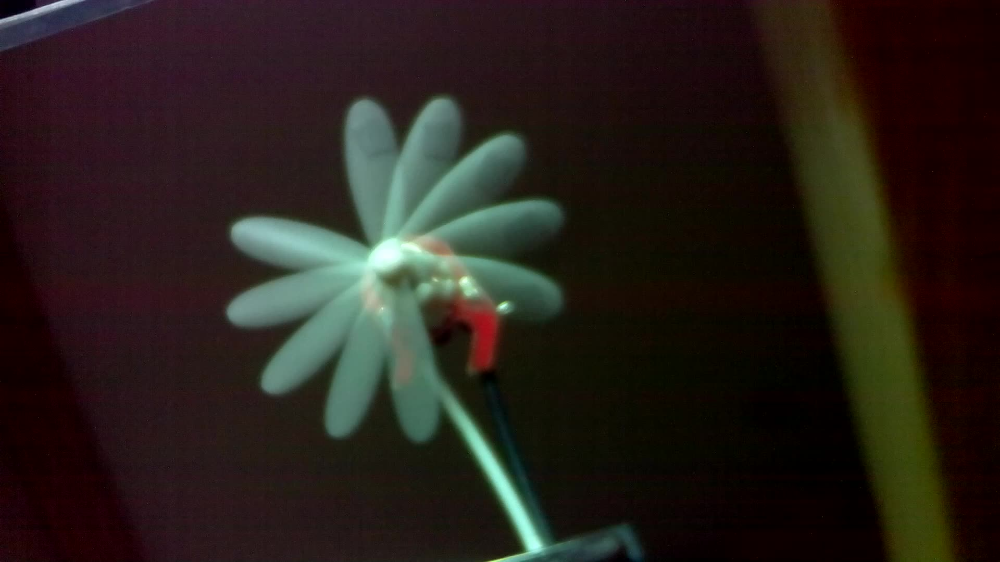
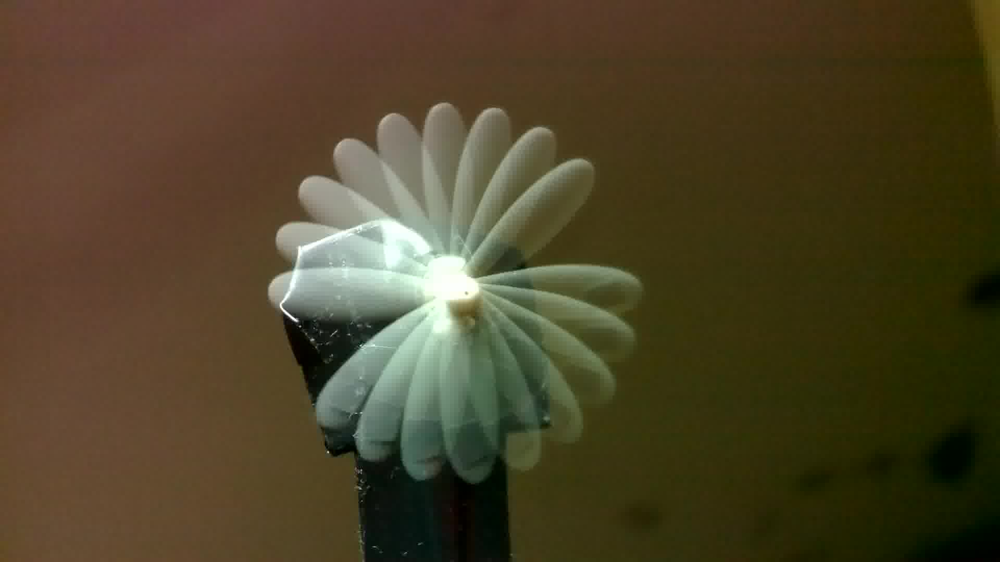

## Raspberry v1 camera global external shutter

Raspberry v1 camera (or clone, v1 camera was sold last 2016 by Raspberry Pi Foundation) does not provide a global shutter mode. But it does provide a "global reset" feature. This repo describes how to build an external shutter for v1 camera and allow for Raspberry v1 camera global external shutter videos.

So why do you may want global shutter videos?

Mostly for fast moving scenes. The propeller of the mini drone rotates with 26000rpm and has a blade diameter of 34mm. The radial speed at blade tips is quite high, 0.034mm*pi*(26000/60)=46.3m/s(!) or 166.6km/h.

This is the frame you get with v1 camera normal [https://en.wikipedia.org/wiki/Rolling_shutter](rolling shutter) mode, total distortion: 

This is animation of video taken with global external shutter technique (scene lit by 5000lm led with 36µs strobe pulse duration): 

How do you get that? By powering off light after then end od the strobe pulse, and a really dark scene in that case. Only that way further accumulation of light can be avoided for the lower lines of the frame that are sent to Pi rom camera later than the very first lines.

## Setup for global external shutter

This is te setup:

You need:
* very bright 50W 5000lm led (2$)
* 50W led driver (7$)
* plastic COB reflector (3$)
* IRF520 mosfets (2×1$)
* v1 camera (clone 6$)
* mini drone propeller (1$)

The 0-24V IRF520s mosfets are used in series to control 38V/1.5A from 50W led driver to 5000lm led. Pi GPIO13 is connected with both mosfets SIG pins. Power the propeller from an independent power source, I use a constant voltage power supply because that allows to easily change propeller voltage and by that propeller rpm.

## Tools

* raspivid_gse (starting with default parameters captures enless tst.h264 video at 1fps global external shutter mode)
* raspividyuz_gse (global external shutter for raspividyuv)
* shot (single shot exposure)
* shots (multiple shots exposure)
* 5shot (sample for different strobe pulse length multiple exposure)
* toFrames (converts .h264 vide (tst.h264 by default) to multiple frames (frame0000.jps, frame0001.jps, ...)

## Requirements

Hardware PWM is available on GPIO18 and GPIO13 only.
Software PWM frequencies are too restricted (http://abyz.me.uk/rpi/pigpio/pigs.html#PFS).

raspivid*_ges and shot/shots tools do work on any pin.

Tools shot/shots/5shots/raspivid*_gse require pigpio being installed:
[pigpio library](http://abyz.me.uk/rpi/pigpio/download.html)

Tool toFrames requires ffmpeg being installed.

## single exposure

If at most one strobe flash happens per frame, that is single exposure global shutter capturing. Tool [shot](tools/shot) allows you to send a single flash pulse (by default 9µs pulse duration to GPIO13, you can pass different arguments):

	$ shot 9 13
	$

## multiple exposure

In this scenarion more than one strobe flash happens  per frame captured. Tool [shots](tools/shots) allows to send multiple strobe pulses (by default five 9µs pulses 241µs apart on GPIO13):

	$ shots
	$

Same scene with different lighting, in case you have no room where you can close all doors and all window shutters. Just put a moving box above the complete setup:

Different parameters example:

	$ ./shots 9 9 116
	$

Tool [5shots](tools/5shots) does 5 exposures with different strobe pulse widths (1/3/5/7/9µs pulse widths):

	$ ./5shots
	$

Same with slightly different lighting:

"shots 2 9 900000" captures two 9µs strobe pulse widths, 0.9s apart. With raspivid_ges tool's "-fps 1" default setting most times the first flash happens on one tst.h264 frame captured, and the 2nd flash happens on the next frame. But after 15 attempts I was successful and captured both flashes on same frame, proving that it is possible:

## PWM exposure

Above captures were all radial, this one is linear. The frame captured 6mm diameter airsoft pistol bullet in flight. A fixed length pigpio waveform (as in shots) would need synchronization between triggering shot and triggering waveform (accoustic, laser light barrier or 665/1007fps high framerate video detection).  The simpler approach taken here is to use 3kHz PWM signal on GPIO13 with duty cycle 2.5% (8.33µs). Each 1fps frame gets 3000 flashes. This cannot be done inside moving box because all you would get is a white frame.

	$ pigs hp 13 3000 25000; sleep 2; pigs hp 13 0 0
	$

The frame is not perfect, just the first capture of flying bullet, not sharp because lens was not adjusted well, but it is a prove that capturing (rifle) bullets in flight is possible with v1 camera!

The frame allowed to determine bullet speed while flying through camera view! The bullet diameter is 6mm, and I used gimp to measure diameter of bullet as 357 pixel. The distance from left side of 2nd to left side of 3rd bullet in frame was 563 pixels. Bullet speed therefore is (563/357*0.006mm)*3000 = 28.38m/s.

Tools raspivid*_gse require camera and I2C enabled in raspi-config Interfacing options.
